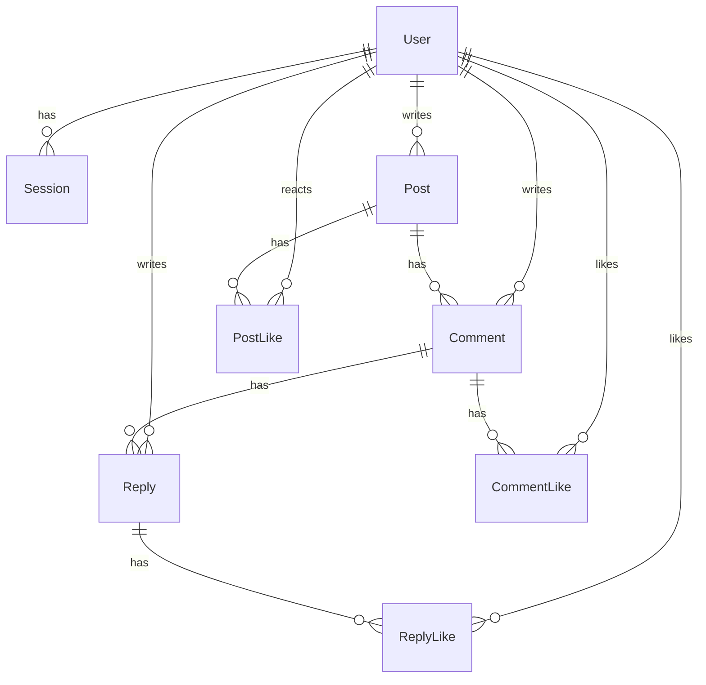
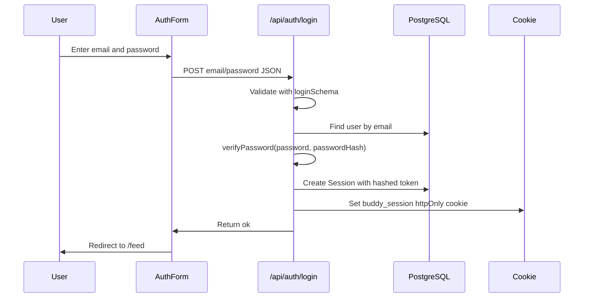
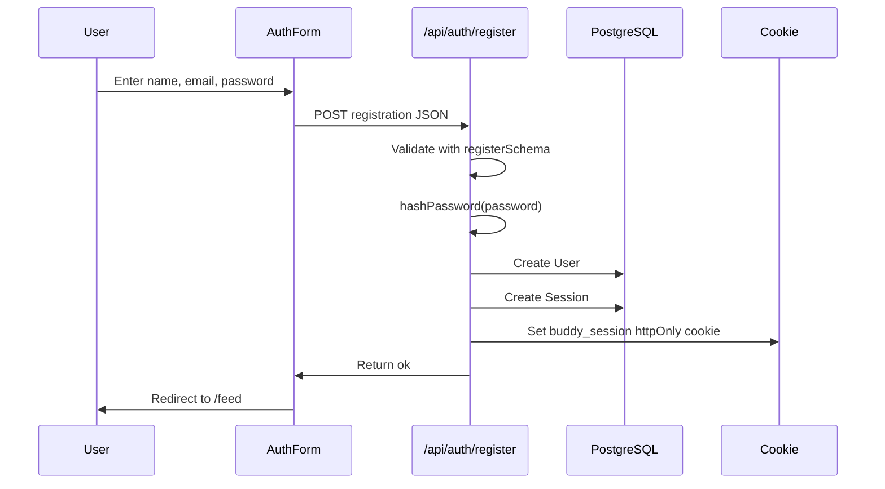
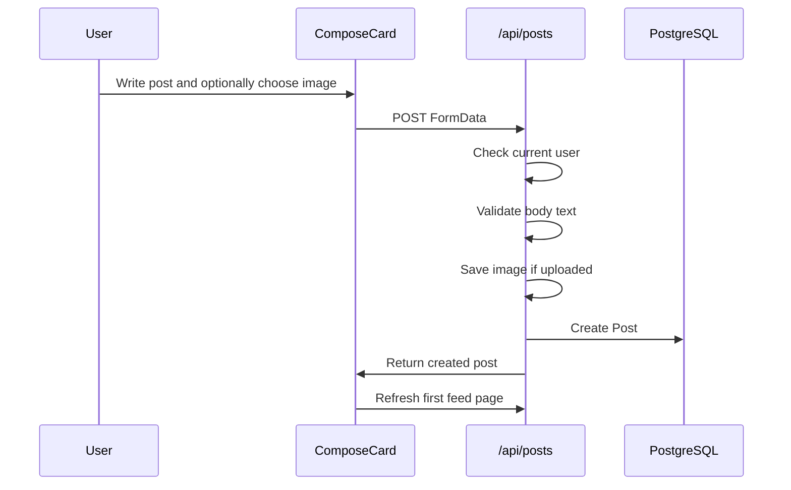

# Buddy Script System Design Notes

This note explains how the project works in beginner-friendly language. Use it to learn the database design, authentication flow, registration flow, and feed loading behavior.

## Important Files

| Area | File |
| --- | --- |
| Database schema | `prisma/schema.prisma` |
| Prisma client setup | `lib/prisma.ts` |
| Password hashing | `lib/password.ts` |
| Session/cookie helpers | `lib/auth.ts` |
| Form/API validation | `lib/validators.ts` |
| Login API | `app/api/auth/login/route.ts` |
| Registration API | `app/api/auth/register/route.ts` |
| Logout API | `app/api/auth/logout/route.ts` |
| Feed page server load | `app/feed/page.tsx` |
| Feed client UI | `components/FeedClient.tsx` |
| Feed post query helper | `lib/posts.ts` |
| Posts API | `app/api/posts/route.ts` |

## Big Picture

The app is a social feed. A user can register, log in, create posts, comment, reply, and react. The frontend is built with React components inside Next.js. The backend is built with Next.js API routes. Prisma talks to PostgreSQL.

```text
Browser
  |
  | React UI submits forms / fetches data
  v
Next.js pages and API routes
  |
  | Prisma queries
  v
PostgreSQL database
```

## Database Design

The database schema is defined in `prisma/schema.prisma`. Prisma uses this file to create tables and generate the TypeScript database client.

### Entity Relationship Diagram



### Tables

`User`

Stores account information. Important fields:

- `id`: unique user id.
- `firstName`, `lastName`, `email`: profile/login information.
- `passwordHash`: hashed password, not the raw password.
- `avatarUrl`: profile image path.

`Session`

Stores login sessions. Important fields:

- `tokenHash`: hashed session token.
- `userId`: points to the logged-in user.
- `expiresAt`: when the login expires.

The browser stores the raw session token in an httpOnly cookie, but the database stores only the hash.

`Post`

Stores feed posts. Important fields:

- `body`: post text.
- `imageUrl`: optional uploaded image path.
- `visibility`: `PUBLIC` or `PRIVATE`.
- `authorId`: points to the user who created the post.

`Comment`

Stores comments on posts.

- `postId`: the post being commented on.
- `authorId`: the user who wrote the comment.

`Reply`

Stores replies under comments.

- `commentId`: the parent comment.
- `authorId`: the user who wrote the reply.

`PostLike`, `CommentLike`, `ReplyLike`

These are reaction/like tables. They connect a user to the thing they liked.

Important design choice:

- `PostLike` has `@@unique([postId, userId])`, so one user can react to a post only once.
- `CommentLike` has `@@unique([commentId, userId])`.
- `ReplyLike` has `@@unique([replyId, userId])`.

## Login Flow

Login starts in the React form and ends with an httpOnly cookie.



Step by step:

1. `components/AuthForm.tsx` sends email and password to `/api/auth/login`.
2. `app/api/auth/login/route.ts` validates the request with `loginSchema`.
3. The API finds the user by email.
4. It checks the password with `verifyPassword()` from `lib/password.ts`.
5. If valid, it calls `createSession()` from `lib/auth.ts`.
6. `createSession()` creates a random token, hashes it, and stores the hash in `Session`.
7. `setSessionCookie()` sends the raw token to the browser as an httpOnly cookie.
8. The user is redirected to `/feed`.

Why httpOnly matters:

An httpOnly cookie cannot be read by normal browser JavaScript. This helps protect the session token from XSS attacks.

## Registration Flow

Registration creates a new user and immediately logs them in.



Step by step:

1. `components/AuthForm.tsx` sends first name, last name, email, and password to `/api/auth/register`.
2. `app/api/auth/register/route.ts` validates the data with `registerSchema`.
3. The password is hashed using PBKDF2 in `lib/password.ts`.
4. Prisma creates a new `User`.
5. If the email already exists, Prisma returns error `P2002`, and the API returns a friendly message.
6. A session is created and an httpOnly cookie is set, just like login.

## How Passwords Work

The app never stores raw passwords.

`hashPassword(password)`:

1. Creates a random salt.
2. Runs PBKDF2 with SHA-512.
3. Stores `iterations:salt:hash`.

`verifyPassword(password, storedHash)`:

1. Reads the iterations and salt from the stored value.
2. Hashes the submitted password the same way.
3. Uses `crypto.timingSafeEqual()` to compare hashes.

## How Current User Detection Works

`getCurrentUser()` in `lib/auth.ts` checks whether the request has a valid session.

```text
Request comes in
  |
  v
Read buddy_session cookie
  |
  v
Hash cookie token
  |
  v
Find matching Session.tokenHash in database
  |
  v
If session exists and not expired, return session.user
```

The `/feed` page uses this function. If there is no user, it redirects to `/login`.

## Feed Loading and Pagination

The app is designed not to load every post at once.

Key files:

- Query helper: `lib/posts.ts`
- API route: `app/api/posts/route.ts`
- Client scroll loader: `components/FeedClient.tsx`

The first page loads up to 10 posts.

```text
/feed server page
  |
  v
getFeedPosts(user.id)
  |
  v
returns { posts, nextCursor, hasMore }
```

When the user scrolls near the bottom of the center feed column, the client calls:

```text
/api/posts?limit=10&cursor=POST_ID
```

That returns the next 10 posts. When there are no more posts, the UI shows:

```text
All posts shown. You are fully caught up.
```

This matters because a database with 100000 posts should not send all posts to the browser. Pagination keeps the app faster and cheaper.

## Feed Visibility Rules

The feed query returns:

- public posts from everyone.
- private posts only when the logged-in user is the author.

In plain English:

```text
Show me posts where:
  visibility is PUBLIC
  OR authorId is my user id
```

## Sidebar People Lists

The sidebar people list is derived from loaded feed data:

- post authors
- comment authors
- reply authors

The logged-in user is filtered out, so the user does not see themselves in Suggested People or Your Friends.

## How Posting Works



Images are saved under `public/uploads`.

## How Likes/Reactions Work

Post reactions use `PostLike`.

Because `PostLike` has a unique rule on `[postId, userId]`, each user can only have one reaction per post. If the user chooses a new reaction, the existing one is replaced.

Comment and reply likes work similarly, but they use `CommentLike` and `ReplyLike`.

## What to Say if Someone Asks About the System

Short answer:

This is a Next.js social feed app using Prisma and PostgreSQL. Users register or log in with hashed passwords. Sessions are stored in the database using hashed session tokens, while the browser receives an httpOnly cookie. The feed uses cursor pagination so the app loads only 10 posts at first and fetches more when the user scrolls. The schema is relational: users own posts, posts have comments, comments have replies, and likes/reactions are separate join tables with unique constraints.

Longer answer:

The frontend uses React components such as `FeedClient`, `ComposeCard`, `PostCard`, `LeftSidebar`, and `RightSidebar`. Server-side pages use `getCurrentUser()` to protect routes. API routes handle login, registration, post creation, comments, replies, and likes. Prisma models define relations and indexes, and the feed query includes related author, likes, comments, and replies so the UI can render each post card.

## Learning Path for This Project

If you are new to React/Next.js, study in this order:

1. `components/AuthForm.tsx`: how forms submit data.
2. `app/api/auth/register/route.ts`: how an API route receives data.
3. `lib/validators.ts`: how Zod validates data.
4. `lib/password.ts`: how passwords are hashed.
5. `lib/auth.ts`: how sessions and cookies work.
6. `prisma/schema.prisma`: how database tables and relations are designed.
7. `lib/posts.ts`: how the feed query works.
8. `components/FeedClient.tsx`: how React state, scrolling, and API calls work together.
