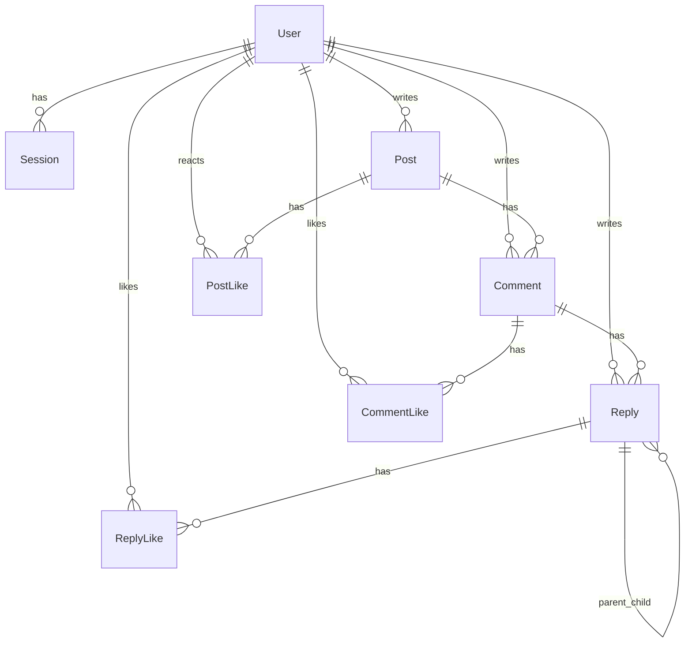
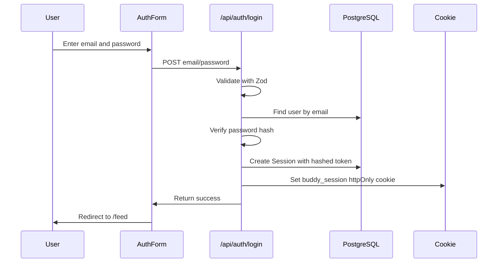
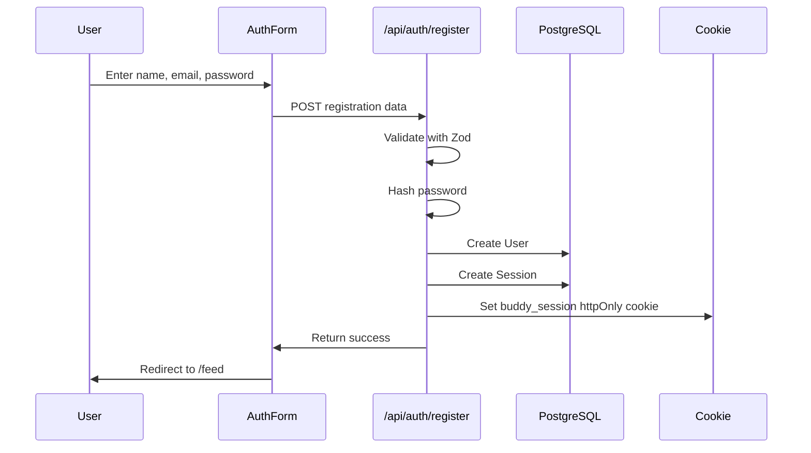
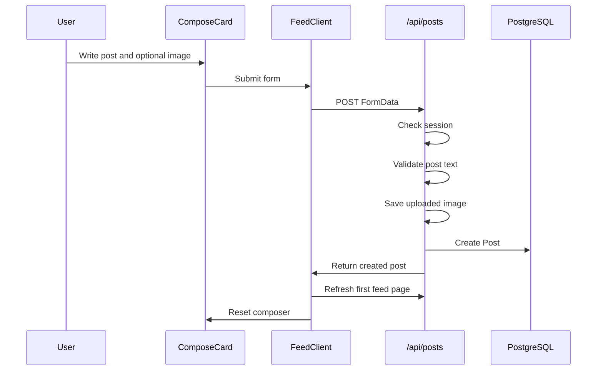

# Buddy Script System Design Notes

This document explains how the Buddy Script Next.js project is designed. It is written as a learning guide, so you can understand the system well enough to explain it in an interview or to another developer.

## 1. Project Overview

Buddy Script is a social feed application built with:

- Next.js App Router for pages and API routes.
- React components for the UI.
- Prisma as the database ORM.
- PostgreSQL as the relational database.
- httpOnly cookie sessions for authentication.
- PBKDF2 password hashing.
- Cursor pagination for scalable feed loading.

The app supports:

- Registration and login.
- Session-based protected feed access.
- Creating posts with optional images.
- Public/private post visibility.
- Post reactions.
- Comments.
- Reply threads up to 3 levels.
- Comment/reply likes.
- Owner-only delete for posts, comments, and replies.
- `@` mention suggestions in comment/reply inputs.
- Infinite scroll that loads posts in chunks instead of loading the whole database.

```text
Browser
  |
  | React components submit forms and call fetch()
  v
Next.js pages and API routes
  |
  | Prisma Client
  v
PostgreSQL database
```

## 2. Important Files

| Area | File |
| --- | --- |
| Database schema | `prisma/schema.prisma` |
| Database migrations | `prisma/migrations/*/migration.sql` |
| Default seed | `prisma/seed.ts` |
| 2000-post seed | `prisma/seed-200.ts` |
| 1000-user seed | `prisma/seed-1000-users.ts` |
| Prisma client singleton | `lib/prisma.ts` |
| Password hashing | `lib/password.ts` |
| Session and cookie helpers | `lib/auth.ts` |
| API validation schemas | `lib/validators.ts` |
| Feed query and reply tree logic | `lib/posts.ts` |
| Protected feed page | `app/feed/page.tsx` |
| Main feed client state | `components/FeedClient.tsx` |
| Post/comment/reply UI | `components/feed/PostCard.tsx` |
| Create-post UI | `components/feed/ComposeCard.tsx` |
| Feed header/topbar | `components/feed/FeedHeader.tsx` |
| Feed sidebars | `components/feed/LeftSidebar.tsx`, `components/feed/RightSidebar.tsx` |
| Global/reference styling | `app/globals.css` |

## 3. Source Code Design

The source is split by responsibility.

### `app/`

The `app/` folder contains Next.js routes.

- `app/page.tsx` redirects users depending on login state.
- `app/login/page.tsx` and `app/register/page.tsx` show auth pages.
- `app/feed/page.tsx` is a server component. It checks the current user, loads the first feed page, and passes data into `FeedClient`.
- `app/api/**/route.ts` files are backend endpoints.

Why API routes are used:

- They keep database writes on the server.
- They protect actions with `getCurrentUser()`.
- They keep secrets, file writes, and Prisma queries away from browser code.

### `components/`

The `components/` folder contains React UI.

- `AuthForm` handles login/register form behavior.
- `FeedClient` owns interactive feed state: posts, pagination, drafts, theme, likes, delete actions, and refreshes.
- `ComposeCard` handles the create-post input.
- `PostCard` renders a post plus comments, reply threads, mention suggestions, likes, and delete buttons.
- `FeedHeader`, `LeftSidebar`, `RightSidebar`, and `Stories` keep the feed page split into understandable UI pieces.

This split is useful because `FeedClient` manages data behavior, while smaller feed components handle display and interaction details.

### `lib/`

The `lib/` folder contains shared backend logic.

- `prisma.ts` creates one Prisma Client instance.
- `auth.ts` creates, reads, and clears login sessions.
- `password.ts` hashes and verifies passwords.
- `validators.ts` defines Zod validation rules.
- `posts.ts` contains feed query logic, pagination defaults, and reply tree building.

Keeping this logic in `lib/` avoids copying the same logic into many API routes.

## 4. CSS and UI Design

The app uses `app/globals.css` plus the supplied reference CSS files from `public/assets/css`.

The current feed UI follows the reference design:

- fixed topbar layout
- left, center, and right scroll areas
- light/dark body backgrounds
- reference-like card spacing
- reference-like buttons, search fields, text sizes, hover states, and icons
- comment/reply bubbles
- threaded reply indentation
- compact mention suggestion menu

Why most styling is in CSS instead of inline styles:

- The reference design is CSS-heavy.
- Global class names make it easier to match exact spacing and colors.
- Dark-mode overrides are easier to group in one place.
- Responsive layout rules are easier to audit.

The feed layout intentionally avoids whole-page scrolling on desktop. Instead, the left, center, and right feed columns scroll independently, like the reference file.

## 5. Database Design

The database schema is defined in `prisma/schema.prisma`.

### Entity Relationship Diagram



### Main Tables

`User`

Stores account/profile data.

Important fields:

- `email` is unique, so two users cannot register with the same email.
- `passwordHash` stores a secure hash, not the raw password.
- `avatarUrl` stores the image path used by the UI.

`Session`

Stores login sessions.

Important fields:

- `tokenHash` is unique.
- `userId` connects the session to a user.
- `expiresAt` controls session lifetime.

The raw session token is only stored in the browser cookie. The database stores a hash of that token.

`Post`

Stores feed posts.

Important fields:

- `visibility` is `PUBLIC` or `PRIVATE`.
- `authorId` connects the post to the user.
- `imageUrl` stores optional uploaded image paths.

Indexes:

- `@@index([visibility, createdAt(sort: Desc)])` helps public feed queries.
- `@@index([authorId, createdAt(sort: Desc)])` helps author-specific/private-post queries.

`Comment`

Stores direct comments on posts.

Important fields:

- `postId` connects to the post.
- `authorId` connects to the user.

`Reply`

Stores replies under comments and replies.

Important fields:

- `commentId` always points to the original top-level comment.
- `parentId` optionally points to another reply.
- If `parentId` is `null`, it is a direct reply to the comment.
- If `parentId` has a value, it is a reply to another reply.

The app limits visible/allowed reply threads to 3 levels:

```text
Level 1: Comment
Level 2: Reply to comment
Level 3: Reply to reply
```

After level 3, the UI hides the Reply button and the API rejects deeper nested replies. The user should create a new direct comment instead. This keeps the feed readable and avoids deeply nested conversations becoming messy on mobile.

`PostLike`, `CommentLike`, `ReplyLike`

These are join tables between users and liked/reacted content.

Important constraints:

- `PostLike` has `@@unique([postId, userId])`.
- `CommentLike` has `@@unique([commentId, userId])`.
- `ReplyLike` has `@@unique([replyId, userId])`.

That means a user can like/react to the same item only once.

## 6. Why Prisma Was Chosen

Prisma is used because it gives a strong developer experience for a TypeScript/Next.js app.

Benefits:

- The schema is readable and becomes the source of truth.
- Prisma generates TypeScript types from the database model.
- Relations are easier to query with `include` and `select`.
- Migrations are tracked in the repository.
- It reduces handwritten SQL for common CRUD work.
- It works well with PostgreSQL and Next.js API routes.

Example:

Instead of writing raw SQL joins manually, the feed can ask Prisma for posts, authors, likes, comments, and replies in one structured query.

## 7. Other Database Options

There were other reasonable choices.

### Raw SQL with `pg`

Pros:

- Maximum control.
- Very fast when carefully written.
- No ORM abstraction.

Cons:

- More boilerplate.
- More manual TypeScript typing.
- More room for query mistakes.
- Migrations need another tool or custom process.

Why not chosen:

For this project, speed of development, type safety, and readability matter more than hand-optimizing every SQL query.

### Drizzle ORM

Pros:

- Very TypeScript-friendly.
- SQL-like style.
- Lightweight.

Cons:

- Slightly more manual relation/query composition than Prisma.
- Prisma is easier for beginners to understand from the schema file.

Why not chosen:

Prisma gives a clearer learning path for schema, relations, migrations, and generated client usage.

### TypeORM

Pros:

- Mature ORM.
- Decorator-based entity style.

Cons:

- More runtime magic.
- Decorators can feel heavier.
- Prisma has a cleaner workflow in modern Next.js projects.

Why not chosen:

Prisma is simpler and more predictable for this app.

### Mongoose/MongoDB

Pros:

- Flexible document shape.
- Good for document-heavy apps.

Cons:

- Social feeds have many relational rules: users, posts, comments, replies, likes, uniqueness, and ownership.
- Joins/relations are more natural in PostgreSQL.

Why not chosen:

This app is relational, so PostgreSQL plus Prisma is a better fit.

## 8. Migration Design

The project currently uses one fresh initial migration:

- `20260613000000_init`: creates the full current schema in one clean migration.

This migration includes:

- all base tables
- `PostLike.reaction` for post reactions
- `Reply.parentId` for threaded replies
- indexes and foreign keys

Earlier development migrations were squashed into this single init migration because the project is still local/dev and the database can be reset safely. This keeps the migration history easier to understand.

Important production note:

Do not squash already-deployed migrations in a shared or production database. Once other environments have applied migrations, changing migration history can create Prisma drift. Squashing was acceptable here because the local database was reset and reapplied from scratch.

## 9. Authentication Design

The app uses database-backed sessions with httpOnly cookies.

### Login Flow



### Registration Flow



### Current User Lookup

`getCurrentUser()` works like this:

```text
Read buddy_session cookie
  |
Hash the raw cookie token
  |
Find matching Session.tokenHash in DB
  |
Check expiresAt
  |
Return session.user or null
```

Protected pages and API routes use this helper.

## 10. JWT Explanation

JWT means JSON Web Token.

A JWT is useful when you want stateless authentication: the server signs user/session data into a token, and later the server verifies that token without checking a database session row every time.

Important clarification:

This project does not use JWT. It uses opaque random session tokens stored in httpOnly cookies.

JWT is not strictly necessary here. What is necessary is a secure way to prove that the browser belongs to a logged-in user. A JWT is one possible way. A database-backed session token is another way.

## 11. Why This App Uses DB Sessions Instead of JWT

We chose database-backed sessions because:

- Sessions can be revoked immediately by deleting a `Session` row.
- Logout is simple and reliable.
- Session expiry is stored and queryable.
- The token stored in the cookie is opaque, meaning it contains no user data.
- It is easier for beginners to reason about.
- It works well for a traditional web app where the Next.js server and database are available.

JWT alternatives:

### JWT in httpOnly Cookie

Pros:

- Still protected from JavaScript when httpOnly.
- Can reduce database reads if fully stateless.

Cons:

- Harder to revoke immediately unless you add a denylist or token version table.
- More careful design needed for refresh tokens.
- If you put too much data inside the JWT, stale user data can live until token expiry.

Why not chosen:

This project benefits more from easy logout/revocation than from stateless tokens.

### JWT in localStorage

Pros:

- Easy for frontend JavaScript to read and attach to API calls.

Cons:

- Exposed to XSS.
- Usually worse for browser security than httpOnly cookies.

Why not chosen:

The app is a browser-based social feed, so httpOnly cookies are safer.

### Third-Party Auth Provider

Examples: Auth.js, Clerk, Firebase Auth, Supabase Auth.

Pros:

- Faster production auth setup.
- OAuth/social login support.
- Many security features included.

Cons:

- More external dependency.
- Less educational for learning how auth works internally.
- May be too heavy for this coding task.

Why not chosen:

This project is easier to explain and learn from with a custom small session system.

## 12. Password Hashing

The app never stores raw passwords.

`hashPassword(password)`:

1. Creates a random salt.
2. Runs PBKDF2 with SHA-512.
3. Stores the result as `iterations:salt:hash`.

`verifyPassword(password, storedHash)`:

1. Reads the iterations and salt.
2. Hashes the submitted password the same way.
3. Uses `crypto.timingSafeEqual()` to compare hashes.

Why this matters:

- If the database leaks, attackers do not immediately get raw passwords.
- Salt makes identical passwords produce different hashes.
- PBKDF2 makes brute force more expensive.

## 13. Feed Loading and Pagination

The feed does not load all posts at once.

Initial load:

```text
app/feed/page.tsx
  -> getCurrentUser()
  -> getFeedPosts(user.id, { limit: 10 })
  -> render FeedClient
```

Scroll loading:

```text
User scrolls center feed column near bottom
  |
  v
FeedClient calls /api/posts?limit=10&cursor=POST_ID
  |
  v
API returns next chunk of posts
```

Why this is important:

If the database has 100000 posts, loading all posts would be slow and expensive. Cursor pagination loads only a small chunk at a time.

Current defaults:

- Default feed limit: 10 posts.
- Max feed limit: 20 posts.

The UI shows this message when no more posts are available:

```text
All posts shown. You are fully caught up.
```

## 14. Feed Query Logic

The feed query lives in `lib/posts.ts`.

It returns:

- public posts from everyone
- private posts only if the logged-in user is the author
- post authors
- post likes and reactions
- comments
- comment likes
- replies
- reply likes

Visibility logic:

```text
Show posts where:
  visibility = PUBLIC
  OR authorId = current user id
```

Reply tree logic:

The database stores replies in a flat table. Each reply has:

- `commentId`
- optional `parentId`

`lib/posts.ts` builds this into a tree before sending it to the UI.

Why store flat but render as a tree:

- Flat storage is easier to query and index.
- Tree rendering is easier for React.
- This avoids a hard-coded Prisma include depth.

## 15. Posting Flow



The composer resets after a successful post:

- textarea clears
- selected image preview clears
- visibility resets to public
- composer collapses back to the fresh state

## 16. Comment and Reply Flow

Direct comment:

```text
POST /api/posts/[postId]/comments
```

Reply to comment:

```text
POST /api/comments/[commentId]/replies
```

Reply to reply:

```text
POST /api/replies/[replyId]/replies
```

Delete own comment:

```text
DELETE /api/comments/[commentId]
```

Delete own reply:

```text
DELETE /api/replies/[replyId]
```

Owner-only delete logic:

1. API checks current user.
2. API loads the comment/reply.
3. API compares `authorId` with `user.id`.
4. If they match, delete is allowed.
5. If not, the API returns `403`.

## 17. Three-Level Reply Limit

The UI and backend both enforce the rule.

UI enforcement:

- Comment can show Reply.
- First reply can show Reply.
- Second reply does not show Reply.

Backend enforcement:

- `/api/replies/[replyId]/replies` checks whether the parent reply already has a `parentId`.
- If yes, the parent is already level 3, so the API rejects the request.

Why both UI and backend:

- UI gives a good user experience.
- Backend protects the rule even if someone calls the API manually.

## 18. Mentions

The `@` mention feature is implemented in `PostCard.tsx`.

Where it works:

- comment input
- reply-to-comment input
- reply-to-reply input

How it works:

1. User types `@`.
2. The input checks the text before the cursor.
3. If the current word starts with `@`, the UI filters available people.
4. The suggestion menu appears above the input.
5. Clicking a person inserts `@First Last`.

The current mention suggestions come from the loaded feed people list:

- post authors
- comment authors
- reply authors
- excluding the logged-in user

This is a simple local UI feature. It does not yet store mention entities in the database or send notifications.

Future improvement:

- Add a `Mention` table.
- Parse mentions on submit.
- Notify mentioned users.
- Search users from `/api/users?query=...` instead of only loaded feed people.

## 19. Likes and Reactions

Post reactions:

```text
POST /api/posts/[postId]/like
```

Comments:

```text
POST /api/comments/[commentId]/like
```

Replies:

```text
POST /api/replies/[replyId]/like
```

Post reactions support values such as:

- `LIKE`
- `LOVE`
- `HAHA`
- `SAD`
- `CRY`

Comment and reply likes are simpler toggle likes.

The UI uses optimistic updates so the button responds immediately, then refreshes from the server.

## 20. File Uploads

Post images are uploaded with `FormData`.

The API route:

```text
app/api/posts/route.ts
```

does this:

1. Reads the uploaded file.
2. Creates `public/uploads` if needed.
3. Writes the file with a random filename.
4. Stores `/uploads/filename` in `Post.imageUrl`.

The `.gitignore` ignores uploaded files but keeps `public/uploads/.gitkeep`, so the folder exists in the repo.

## 21. Seeds

Seed commands:

```bash
npm run prisma:seed
npm run prisma:seed:2000
npm run prisma:seed:1000-users
```

`prisma:seed`

Creates default demo users and a small data set.

`prisma:seed:2000`

Creates 2000 posts for testing pagination and scroll performance.

`prisma:seed:1000-users`

Adds 1000 users without deleting existing posts.

Demo password:

```text
Password123
```

## 22. Why the Database Is Designed This Way

The database is relational because the app has clear relationships:

- a user owns posts
- a post has comments
- a comment has replies
- a reply can have child replies
- users like/react to posts, comments, and replies

Using separate like tables is better than storing arrays on posts/comments because:

- uniqueness is enforced by the database
- counts can be queried
- deleting a user or post can cascade cleanly
- indexes can make lookups faster

Using `onDelete: Cascade` is useful because:

- deleting a post removes its comments, replies, and likes
- deleting a comment removes its replies and likes
- deleting a reply removes child replies and likes

## 23. How to Explain the System Quickly

Short answer:

Buddy Script is a Next.js social feed app using Prisma and PostgreSQL. Users register or log in with hashed passwords. Login creates a database session and sets an httpOnly cookie. The feed uses cursor pagination, so it loads 10 posts first and fetches more on scroll. The database is relational: users own posts, posts have comments, comments have threaded replies, and likes/reactions are stored in separate unique join tables.

Longer answer:

The frontend is split into React components like `FeedClient`, `ComposeCard`, `PostCard`, `FeedHeader`, and sidebars. `FeedClient` owns feed state and calls API routes. The backend uses Next.js route handlers. Prisma models define tables and relations, and `lib/posts.ts` loads feed data and builds reply trees. Auth uses a secure database session token in an httpOnly cookie instead of JWT because this app benefits from easy logout and session revocation.

## 24. Learning Path

Study in this order:

1. `prisma/schema.prisma`: understand the data model.
2. `lib/password.ts`: learn password hashing.
3. `lib/auth.ts`: learn sessions and cookies.
4. `components/AuthForm.tsx`: learn form submission.
5. `app/api/auth/register/route.ts`: learn registration.
6. `app/api/auth/login/route.ts`: learn login.
7. `lib/posts.ts`: learn feed queries and reply tree building.
8. `components/FeedClient.tsx`: learn React state and API calls.
9. `components/feed/PostCard.tsx`: learn comments, replies, mentions, and actions.
10. `app/globals.css`: learn how the reference design is matched.

## 25. Current Limitations and Future Improvements

Current limitations:

- Mentions are text-only and do not create notifications.
- The people suggestion list comes from loaded feed data, not from a global user search endpoint.
- Comment/reply likes are simple likes, while posts have richer reactions.
- Uploaded files are stored locally in `public/uploads`, which is fine for local development but not ideal for production.

Future improvements:

- Add user search API for mention suggestions.
- Add notification table.
- Store uploads in S3, Cloudflare R2, or another object storage service.
- Add tests for API route permissions.
- Add rate limiting for auth and posting endpoints.
- Add server-side validation for upload size and image type.
